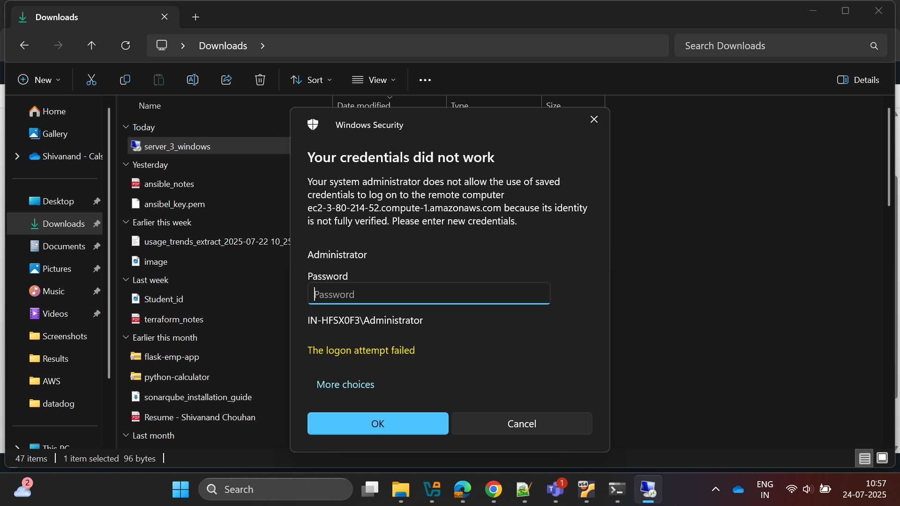

# Ansible Roles Assignment: Multi-Platform Server Configuration

## 📋 Assignment Overview

This assignment demonstrates my implementation of Ansible roles for automated configuration management across multiple platforms. My project showcases the following key capabilities:

- **Linux Patching**: Automated system updates and package management
- **Tomcat Installation**: Java application server deployment on Linux
- **DNS Server Configuration**: Network infrastructure setup
- **IIS Installation**: Web server deployment on Windows servers

## 🏗️ Infrastructure Architecture

### Required EC2 Instances

For this comprehensive assignment, I establish a multi-node infrastructure consisting of three AWS EC2 instances:

1. **🐧 Ubuntu Control Node** (`t2.micro`)
   - Purpose: Ansible automation controller
   - OS: Ubuntu Linux
   - Role: Orchestrates configuration across managed nodes

2. **🐧 Ubuntu Managed Node** (`t2.micro`)  
   - Purpose: Linux target for automation tasks
   - OS: Ubuntu Linux
   - Services: Tomcat, DNS server, system patching

3. **🪟 Windows Managed Node** (`t3.micro`)
   - Purpose: Windows target for automation tasks
   - OS: Windows Server
   - Services: Internet Information Services (IIS)

### Network Security Configuration

#### Ubuntu Instances Security Groups
- **SSH Access**: Port 22 (TCP)
- **Source**: Your IP address or 0.0.0.0/0 for broader access

#### Windows Instance Security Groups
- **WinRM HTTP**: Port 5985 (TCP) - For Ansible communication
- **RDP**: Port 3389 (TCP) - For remote desktop access

> **Note**: WinRM (Windows Remote Management) is essential for Ansible to communicate with Windows hosts, while RDP provides graphical remote access for manual configuration.

## 🚀 Step-by-Step Implementation Guide

### Phase 1: AWS Infrastructure Setup

#### 1.1 Create EC2 Instances

I navigate to the AWS Management Console and launch the three required instances with the specifications mentioned above. I ensure each instance is properly configured with appropriate security groups and key pairs.

Once all instances are running, I can see them in my EC2 dashboard:


#### 1.2 Connect to Ansible Control Node

I establish SSH connection to my Ubuntu Control Node using the key pair I created during the instance setup.

### Phase 2: Ansible Installation and Configuration

#### 2.1 Install Ansible on Control Node

I update the package repository and install Ansible:

```bash
$ sudo apt update
$ sudo apt install software-properties-common
$ sudo add-apt-repository --yes --update ppa:ansible/ansible
$ sudo apt install ansible
```

#### 2.2 Key Management Setup

I transfer the managed node's private key from my local machine to the control node. First I exit the SSH session and then run this command from my local machine:

```bash
scp -i "ansible-control-key.pem" "managed-node-key.pem" ubuntu@<control_node_public_ip>:path

Ex:

scp -i "ansibel_key.pem" ansibel_key.pem ubuntu@ecX-X-XX-XXX-XXX.compute-1.amazonaws.com:/home/ubuntu/keys
```

#### 2.3 hosts Configuration for linux

I SSH back into the Control Node and configure the key permissions and server node into hosts file:

```bash
sudo nano /etc/ansible/hosts
```
Add this:

```
[server]
server_2 ansible_host=<your linux server_node Public IPv4 address>

[server:vars]
ansible_python_interpreter=/usr/bin/python3
ansible_user=ubuntu
ansible_ssh_private_key_file=/home/ubuntu/keys/ansibel_key.pem

```

Using this configuration ansible will ssh to the server nodes.

### Phase 3: Windows Node Configuration

#### 3.1 RDP Connection Setup

I connect to the Windows instance via Remote Desktop Protocol:

1. I select the Windows instance in AWS Console
2. I click "Connect" → "RDP client"
3. I download the RDP file and open it

I see a connection confirmation dialog:


#### 3.2 Authentication Process

The system will prompt for credentials. The default username is `Administrator`:



#### 3.3 Retrieve Windows Password

To obtain the password:

1. I return to AWS Console → RDP client page
2. I click "Get Password"
3. I upload the Windows instance's `.pem` key file
4. I click "Decrypt Password"


#### 3.4 Successful Connection

Once authenticated, I have full access to the Windows server:


#### 3.5 Configure WinRM

I open PowerShell as Administrator and execute these commands to enable Windows Remote Management:

```powershell
winrm quickconfig -q
Set-Item WSMan:\localhost\Service\AllowUnencrypted -Value $true
Set-Item WSMan:\localhost\Service\Auth\Basic -Value $true
netsh advfirewall firewall add rule name="WinRM 5985" dir=in action=allow protocol=TCP localport=5985
Restart-Service WinRM
```
after that set inbound rule in window ec2 for 5985

### Phase 4: Ansible Project Structure

#### 4.1 Create Directory Structure

#### Command to create roles 
``` bash
ansible-galaxy init role_name

```

I return to the Ansible Control Node and create the following project structure:

```bash
.
├── site.yml
├── roles/
│   ├── linux_patching/
│   │   └── tasks/
│   │       └── main.yml
│   ├── tomcat_install/
│   │   └── tasks/
│   │       └── main.yml
│   ├── dns_config/
│   │   └── tasks/
│   │       └── main.yml
│   └── windows_iis/
│       └── tasks/
│           └── main.yml
```

#### 4.2 Configuration Files

##### Ansible Roles
Each role is designed for specific configuration tasks:

- 🔧 [Linux Patching Role](roles/linux_patching/tasks/main.yml) - System updates and package management
- ☕ [Tomcat Installation Role](roles/tomcat_install/tasks/main.yml) - Java application server deployment  
- 🌐 [DNS Configuration Role](roles/dns_changes/tasks/main.yml) - DNS server setup and configuration
- 🪟 [Windows IIS Role](roles/win_iis/tasks/main.yml) - Internet Information Services installation

##### Main Playbook
The master playbook orchestrates all roles:
- 📜 [site.yml](site.yml) - Main Ansible playbook


#### 2.3 hosts Configuration for Windows

I SSH back into the Control Node and configure the key permissions and server node into hosts file:

```bash
sudo nano /etc/ansible/hosts
```
Add this:

```
[winserver]
server_3_windows ansible_host=<your window server_node Public IPv4 address>


[winserver:vars]
ansible_user=Administrator
ansible_password=9?!**************HV4
ansible_connection=winrm
ansible_winrm_server_cert_validation=ignore
ansible_port=5985

```

Using this configuration ansible will connect to the window server nodes.

### Phase 5: Connectivity Testing

#### 5.1 Test Node Connectivity

I verify that Ansible can communicate with all my managed nodes:

```bash
ansible server -m ping
ansible winserver -m win_ping
```

**Expected Output:**
```bash
linux1 | SUCCESS => {
    "changed": false,
    "ping": "pong"
}
windows1 | SUCCESS => {
    "changed": false,
    "ping": "pong"
}
```

### Phase 6: Playbook Execution

#### 6.1 Run the Complete Playbook

I execute the main playbook to apply all configurations:

```bash
ansible-playbook site.yml
```

#### 6.2 Execution Results

My playbook execution demonstrates successful automation across both platforms:

```bash
PLAY [Linux server setup] ***********************************************************************************************************

TASK [Gathering Facts] **************************************************************************************************************
ok: [server_2]

TASK [linux_patching : Update apt cache] ********************************************************************************************
changed: [server_2]

TASK [tomcat_install : Install Java] ************************************************************************************************
ok: [server_2]

TASK [tomcat_install : Download Tomcat] *********************************************************************************************
ok: [server_2]

TASK [tomcat_install : Extract Tomcat] **********************************************************************************************
ok: [server_2]

TASK [dns_changes : Install DNS server (bind9)] *************************************************************************************
ok: [server_2]

TASK [dns_changes : Ensure bind9 is running] ****************************************************************************************
ok: [server_2]

PLAY [Windows IIS_setup] ************************************************************************************************************

TASK [Gathering Facts] **************************************************************************************************************
ok: [server_3_windows]

TASK [win_iis : Install IIS] ********************************************************************************************************
ok: [server_3_windows]

TASK [win_iis : Ensure IIS service is running] **************************************************************************************
ok: [server_3_windows]

PLAY RECAP **************************************************************************************************************************
server_2                   : ok=7    changed=1    unreachable=0    failed=0    skipped=0    rescued=0    ignored=0
server_3_windows           : ok=3    changed=0    unreachable=0    failed=0    skipped=0    rescued=0    ignored=0

```

#### For start the tomcat server 
. First ssh to the slave linux server

```bash
sudo -i 
cd /opt/apache-tomcat-9.0.85/bin
./startup.sh
```

. Then copy the instance public ip and execute it on browser with 8080 like: <your linux public ipv4 ip:8080>


#### For checkup the IIS server

. Just open the window public ipv4 on server


## 🎯 Key Learning Outcomes

### Technical Skills I Demonstrated

1. **Multi-Platform Automation**
   - Linux server configuration and management
   - Windows server administration via Ansible
   - Cross-platform inventory management

2. **Ansible Best Practices**
   - Role-based organization
   - Idempotent task design
   - Inventory management
   - Secure credential handling

3. **Infrastructure as Code**
   - Declarative configuration management
   - Version-controlled automation scripts
   - Repeatable deployment processes

4. **Cloud Security**
   - AWS Security Group configuration
   - SSH key management
   - WinRM secure communication

### Services I Successfully Deployed

- ✅ **Linux System Patching**: Automated updates and security patches
- ✅ **Apache Tomcat**: Java application server with full configuration
- ✅ **BIND9 DNS Server**: Network infrastructure service
- ✅ **Windows IIS**: Web server platform on Windows Server
