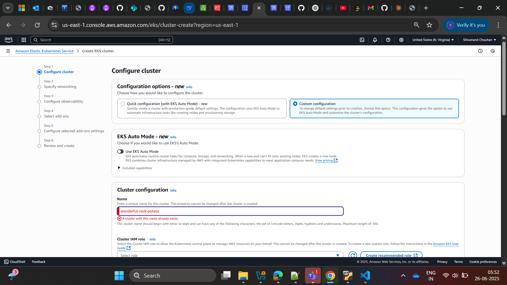
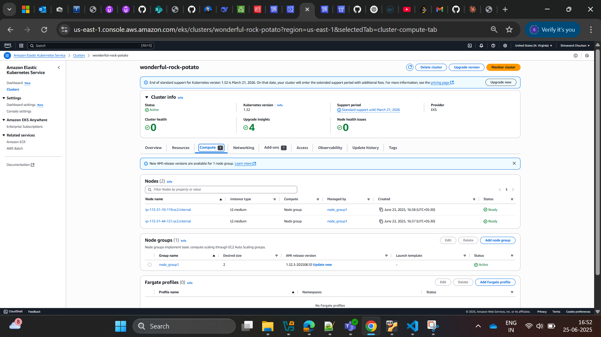
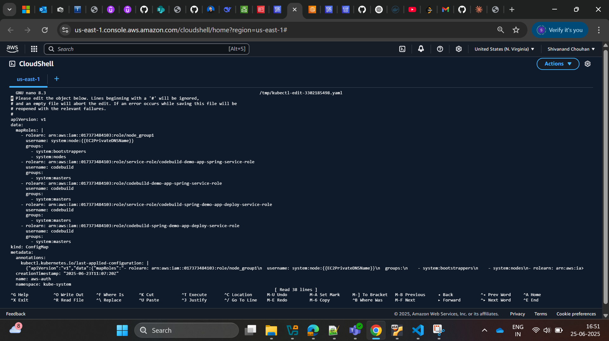
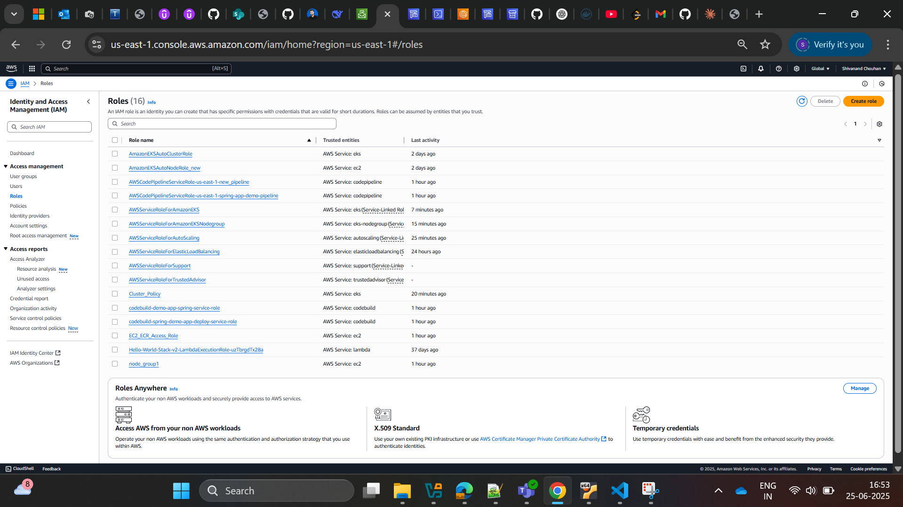
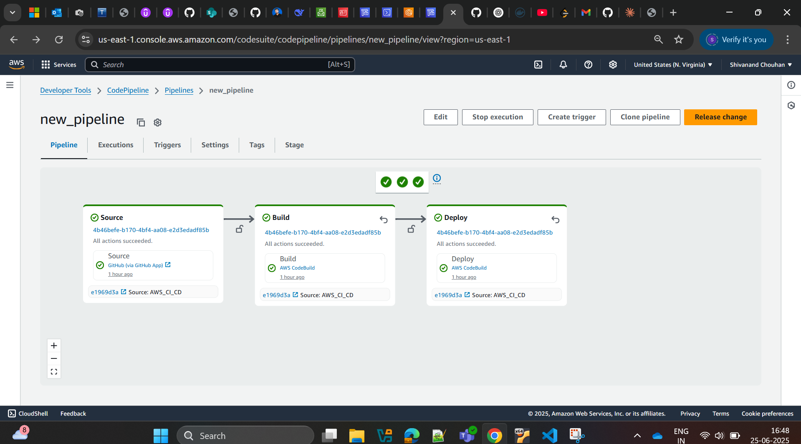

# AWS EKS Cluster Setup (Manual Configuration)

This guide walks you through creating an Amazon EKS cluster without EKS Auto Mode and manually adding worker nodes using the AWS Console.

## Prerequisites
- AWS account with IAM permissions for EKS
- AWS CLI configured with proper credentials
- `eksctl` installed (recommended)
- kubectl installed

---

## Step 1: Create EKS Cluster (Without Auto Mode)

1. Navigate to the Amazon EKS service in AWS Console
2. Click "Add cluster" → "Create"
3. Select "Custom configuration" (not Quick configuration with EKS Auto Mode)
4. Under "EKS Auto Mode" section, choose to **not** use EKS Auto Mode
5. Configure basic cluster settings:
   - **Cluster name**: Enter a unique name (e.g., `my-manual-cluster`)
   - **Kubernetes version**: Select your preferred version
   - **Cluster service role**: Create or select an IAM role with EKS permissions
6. Configure networking (VPC, subnets, security groups)
7. Leave logging options as default or customize as needed
8. Click "Create" and wait for cluster creation (typically 10-15 minutes)

**Cluster Creation Screen Example:**  


---

## Step 2: Add Worker Nodes from Compute Tab

1. Navigate to your EKS cluster in AWS Console
2. Select the **"Compute"** tab in the cluster dashboard
3. Click **"Add node group"** button
4. Configure the node group settings:
   - **Node group name**: Enter a descriptive name (e.g., `prod-worker-nodes`)
   - **Node IAM role**: Select an existing role or create new one with:
     - `AmazonEKSWorkerNodePolicy`
     - `AmazonEC2ContainerRegistryReadOnly`
     - `AmazonEKS_CNI_Policy`
   - **Compute configuration**:
     - AMI type: `Amazon Linux 2` (recommended)
     - Capacity type: On-Demand or Spot
     - Instance type: Select appropriate size (e.g., `t3.medium` for dev, `m5.large` for prod)
   - **Node group scaling configuration**:
     - Desired size: Initial number of nodes (e.g., 2)
     - Minimum size: Minimum nodes for scaling (e.g., 2)
     - Maximum size: Maximum nodes allowed (e.g., 5)
5. **Network configuration**:
   - Select the same VPC used by your cluster
   - Choose subnets across multiple Availability Zones for high availability
6. **Review and create**:
   - Verify all settings
   - Click "Create" to provision the nodes
7. Wait 5-10 minutes for nodes to register with the cluster

**Cluster Nodes/Compute Tab Example:**  


---

## Verify Node Connection
After creation:
```bash
kubectl get nodes --watch
```

---

## Step 3: Verify Cluster Access

1. Update your kubeconfig:
   ```bash
   aws eks update-kubeconfig --name my-manual-cluster --region us-west-2
   ```
2. Test access:
   ```bash
   kubectl get nodes
   ```

# How to Create an AWS CodeBuild Project (Console) to Build and Deploy to EKS Using `buildspec.yaml`

This guide explains how to set up an AWS CodeBuild project using the AWS Console to build your Spring Boot application, push the Docker image to ECR, and deploy to EKS using your provided `buildspec.yaml`.

---

## Prerequisites

- An EKS cluster with worker nodes and `kubectl` access
- Your application Docker image repository created in ECR (the buildspec will create it if missing)
- `AWS_Deployment.yaml` and `buildspec.yaml` files are present in your repository
- The CodeBuild IAM role is mapped in your EKS cluster's `aws-auth` ConfigMap with `system:masters` group
- The CodeBuild IAM role has permissions for EKS, ECR, S3, and CloudWatch Logs

---

## Step 1: Prepare Your Source Repository

- Ensure your repository (GitHub, CodeCommit, etc.) contains:
  - `AWS_Deployment.yaml`
  - `buildspec.yaml` (see below)
  - Your application source code and Dockerfile

---

## Step 2: Create a CodeBuild Project

1. **Go to the [AWS CodeBuild Console](https://console.aws.amazon.com/codebuild/home).**
2. Click **Create build project**.

### Project Configuration

- **Project name:**  
  Enter a name (e.g., `demo-app-spring`).

- **Description:**  
  (Optional) Describe your project.

### Source

- **Source provider:**  
  Select your source (e.g., GitHub, CodeCommit).
- **Repository:**  
  Choose the repository containing your code and `buildspec.yaml`.

### Environment

- **Environment image:**  
  - Choose "Managed image"
  - Operating system: Ubuntu or Amazon Linux 2
  - Runtime: Standard
  - Image: Choose the latest available (e.g., `aws/codebuild/standard:7.0`)
- **Service role:**  
  - Select an existing role or create a new one.
  - Ensure this role has permissions for EKS, ECR, S3, and is mapped in your EKS `aws-auth` ConfigMap.

### Buildspec

- **Buildspec name:**  
  - Use the default `buildspec.yaml` or specify a custom name if needed.

### Artifacts

- **Type:**  
  - No artifacts (unless you want to store build outputs).

### Logs

- Enable CloudWatch logs for troubleshooting.

---

## Step 3: Configure Environment Variables (Optional)

If your `buildspec.yaml` uses variables, add them under **Additional configuration > Environment variables** (e.g., `EKS_CLUSTER_NAME`, `AWS_REGION`).  
In your case, these are already set in the `env:` section of your `buildspec.yaml`.

---

## Step 4: Review and Create

- Review all settings.
- Click **Create build project**.

---

## Step 5: Run the Build

1. On the project page, click **Start build**.
2. Monitor the build logs for progress.
3. If successful, CodeBuild will:
   - Build your Java application with Maven
   - Build and push the Docker image to ECR
   - Deploy to EKS using `kubectl apply -f AWS_Deployment.yaml`
   - Print the service URL if available

---

## `buildspec.yaml` (Used in This Project)

---

## Video Walkthrough

You can also watch the full process in this video:  
[▶️ CodeBuild EKS Deployment Demo (spring-demo-app-deploy_build.mp4)](Images_and_Videos/spring-demo-app-deploy_build.mp4)

---

## Troubleshooting 

- If `kubectl` commands fail with authentication errors, ensure your CodeBuild IAM role is mapped in the EKS `aws-auth` ConfigMap with `system:masters` group.
- Check CloudWatch logs for detailed error messages.
- Make sure your ECR repository and EKS cluster names match those in your `buildspec.yaml`.

---

## Understanding the `aws-auth` ConfigMap for EKS Access

The `aws-auth` ConfigMap in your EKS cluster controls which IAM roles and users are allowed to access and manage the cluster using `kubectl`.  
Below is a screenshot example of a well-configured `aws-auth` file, as seen in your CloudShell editor:

**aws-auth ConfigMap Example:**  


### Explanation

- **node_group1**:  
  This is the IAM role used by your EKS worker nodes.  
  It must always be present so nodes can join and operate in the cluster.

- **CodeBuild roles**:  
  Each `rolearn` entry for CodeBuild (such as `codebuild-demo-app-spring-service-role` and `codebuild-spring-demo-app-deploy-service-role`) allows your CodeBuild projects to access and manage the EKS cluster using `kubectl` commands.
  - The `groups: [system:masters]` line gives these roles full admin access to the cluster (required for CI/CD deployments).

- **Why multiple entries?**  
  If you have several CodeBuild projects or roles, each must be listed here.  
  Both `service-role/` and direct `role/` ARNs are included to cover all possible role naming conventions.

### Best Practices

- **Do not remove the node group role** or your nodes will not be able to join the cluster.
- **Only grant `system:masters` to trusted automation roles** (like CodeBuild for CI/CD).
- If you add new CodeBuild projects with different roles, add their ARNs here as well.

### How to Edit

To update this ConfigMap, run:
```sh
kubectl edit configmap aws-auth -n kube-system
```
Add or remove roles as needed under `mapRoles:`.

---

**Summary:**  
This `aws-auth` ConfigMap ensures both your EKS nodes and your CodeBuild CI/CD jobs have the necessary permissions to operate and deploy workloads in your cluster.

---

## Understanding IAM Roles in Your EKS & CI/CD Setup



### What is an IAM Role?

An **IAM Role** in AWS is an identity with specific permissions that can be assumed by AWS services or users.  
Roles are used to grant access to AWS resources **without using long-term credentials** (like passwords or access keys).

---

### Why Are IAM Roles Important in EKS and CI/CD?

- **EKS Cluster:** Needs a role to manage Kubernetes control plane resources.
- **EKS Node Group:** Each worker node (EC2 instance) assumes a role to interact with the cluster and AWS services.
- **CodeBuild:** The build environment assumes a role to pull/push images, deploy to EKS, and access other AWS resources.
- **CodePipeline:** If used, it also needs a role to orchestrate the pipeline.

---

### Roles in Your AWS Account and Their Usage

Below is a summary of the IAM roles visible in your AWS account and how they are used in your EKS and CI/CD setup:

| Role Name                                         | Used By         | Purpose                                                                                  |
|---------------------------------------------------|-----------------|------------------------------------------------------------------------------------------|
| **AmazonEKSClusterRole**                          | EKS Cluster     | Allows EKS control plane to manage AWS resources (e.g., networking, load balancers).     |
| **node_group1**                                   | EKS Node Group  | Allows EC2 worker nodes to join the cluster and interact with AWS services.              |
| **codebuild-demo-app-spring-service-role**         | CodeBuild       | Used by CodeBuild to build, push Docker images, and deploy to EKS (CI/CD pipeline).      |
| **codebuild-spring-demo-app-deploy-service-role**  | CodeBuild       | Used by another CodeBuild project for deployment to EKS (CI/CD pipeline).                |
| **AWSServiceRoleForAmazonEKSNodegroup**           | EKS Node Group  | Service-linked role for managed node groups (created automatically by AWS).              |
| **AWSServiceRoleForAmazonEKS**                    | EKS Cluster     | Service-linked role for EKS cluster management (created automatically by AWS).           |
| **AWSCodePipelineServiceRole-...**                | CodePipeline    | Used by CodePipeline to orchestrate build and deploy stages (if you use CodePipeline).   |

---

### How They Work Together

- **EKS Cluster** uses `AmazonEKSClusterRole` and `AWSServiceRoleForAmazonEKS` to manage the cluster.
- **EKS Node Group** uses `node_group1` and `AWSServiceRoleForAmazonEKSNodegroup` so worker nodes can join and function.
- **CodeBuild** uses `codebuild-demo-app-spring-service-role` and `codebuild-spring-demo-app-deploy-service-role` to:
  - Pull code from your repo
  - Build and push Docker images to ECR
  - Deploy to EKS using `kubectl`
- **CodePipeline** (if used) uses its own service role to trigger CodeBuild and manage the pipeline.

---

### Why Mapping Roles in `aws-auth` is Critical

- **Node group roles** must be mapped so nodes can join the cluster.
- **CodeBuild roles** must be mapped (with `system:masters` group) so your CI/CD jobs can run `kubectl` commands and deploy to EKS.

---

**Summary:**  
IAM roles are the backbone of secure, permissioned automation in AWS.  
Each service (EKS, EC2 nodes, CodeBuild, CodePipeline) needs its own role, and you must map the right roles in your EKS cluster for everything to work together securely and seamlessly.


# AWS CodePipeline Manual Setup Guide


## Create a Custom Pipeline via AWS Console

### Step 1: Initialize Pipeline Creation
1. Navigate to **AWS CodePipeline** service
2. Click **"Create pipeline"** button
3. Select **"Build custom pipeline"** option

### Step 2: Configure Pipeline Properties
- **Edition**: `new_pipeline` (as shown in reference image)
- **Pipeline type**: Select `V1`
- **Execution mode**: Choose `QRLKID` (or your preferred mode)
  


### Step 3: Set Up Source Stage
1. Click **"Edit: Source"** section
2. Configure source provider (GitHub, CodeCommit, etc.)
3. Set up Git triggers:
   - **Filter type**: Push events
   - **Branch specification**: Include `main` branch
4. Enable **Automated stage configuration**
   - Check "Enable automatic entry on stage failure"
   - Set **Entry code**: `Entry failed stage`

---

## 🟢 Step 4: Configure Build Stage

1. Navigate to **"Edit: Build"** section
2. Select a build provider (e.g., **CodeBuild**, **Jenkins**, etc.)
3. Set stage conditions:
   - **Entry**: Not configured (or define your conditions)
   - **Success/Failure**: Configure actions as needed
4. Enable **Administered stage configuration**:
   - ✅ Check **"Enable automatic entry on stage failure"**
   - 🧾 Set **Entry code**: `Entry failed stage`

---

## 🟢 Step 5: Set Up Display Stage (Optional)

1. Go to **"Edit: Display"** section
2. Click **"Add usage"** to configure display options
3. Set conditions:
   - Define actions for `entry`, `success`, and `failure` as needed

---

## 🟢 Step 6: Review Pipeline Structure

Your pipeline should now include these components:

- ✅ **Source** (e.g., `CodeCommit`, `GitHub`)
- ✅ **Build** (e.g., `CodeBuild`, `Jenkins`, `AirtBrain`)
- 🟡 **Display** (Optional: `CodeDisplay`)
- 🏗 **Pipeline** (Managed by `CodePipeline`)

---

## 🟢 Step 7: Final Configuration

1. Navigate to **Pipeline Settings**
2. Configure **metrics** and **notifications**
3. Set up **account-level metrics** if required
4. Review all stages under **"Action details"**
5. ✅ Click **"Create pipeline"** to deploy

---

**Pipeline Example:**  


## 🚀 Post-Creation Actions

- Monitor pipeline execution in the **History** tab
- View real-time stats in **Pipeline Metrics**
- Adjust triggers and settings under **Account metrics**

---

## ⚠️ Troubleshooting Tips

If the pipeline fails:

- 🔎 Check **"Entry failed stage"** codes
- 🔐 Verify **IAM permissions** for each pipeline stage
- 🔗 Confirm access to the **source repository**
- 📦 Validate your **buildspec.yml** and artifacts path

---

## 🎬 Video Walkthrough

You can also watch the full process in this video:  
[▶️ Custom CodePipeline Demo (custom_code_pipeline.mp4)](Images_and_Videos/custom_code_pipeline.mp4)

